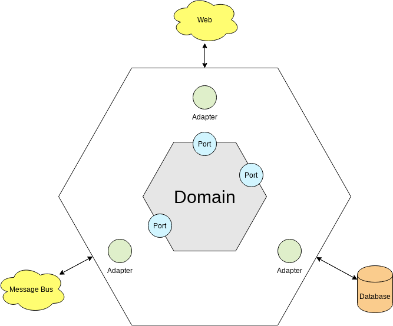
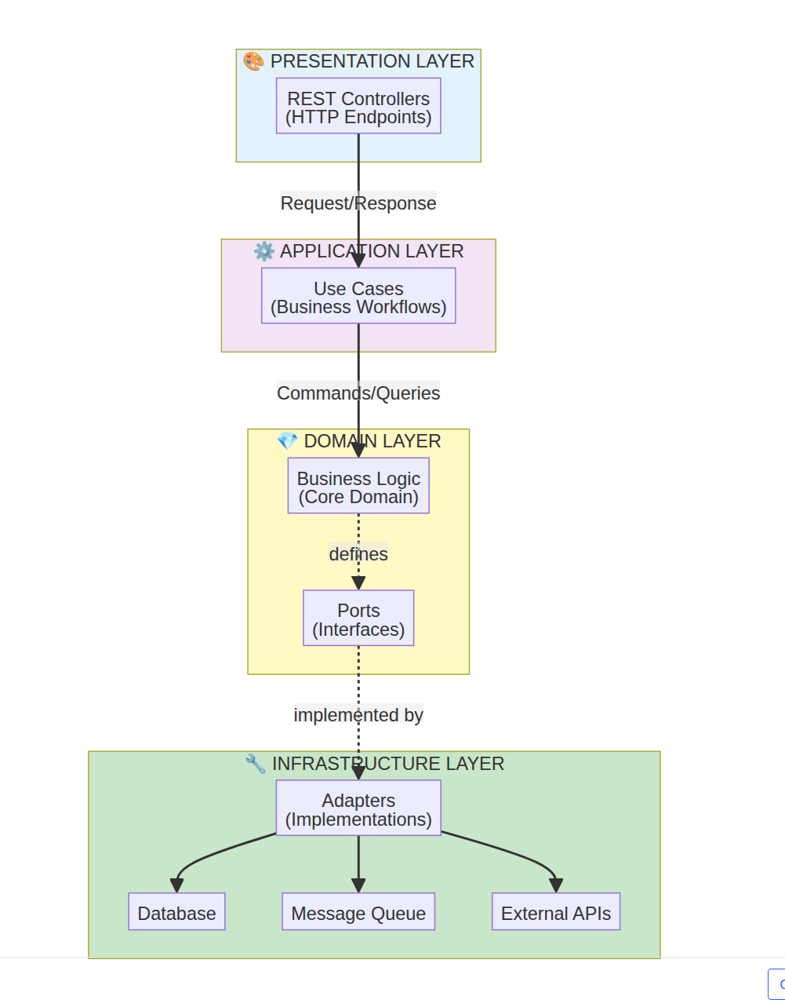
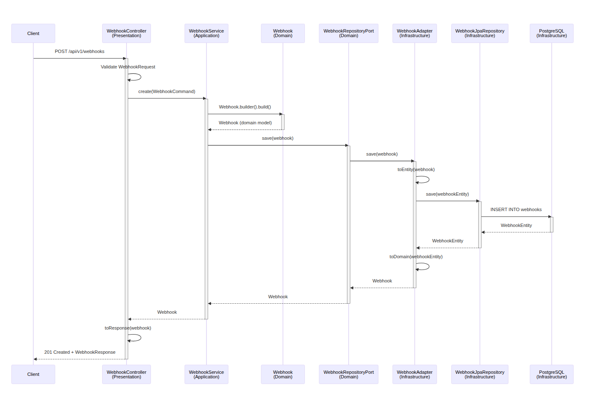
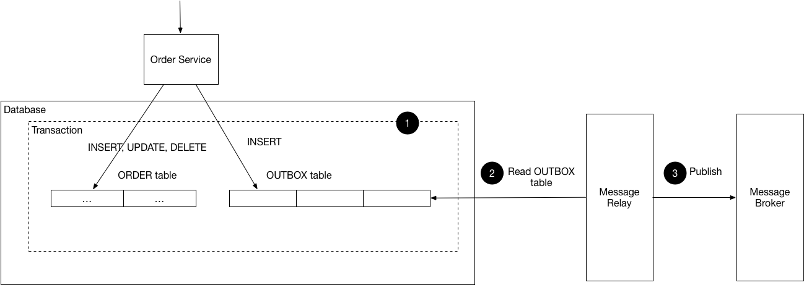

# Description

The coding task is to create a simple payment application.

- You can use any front-end framework you want (e.g. React, Angular, Vue.js,
  etc.). For the back end, you need to use Java 11+ with any framework of your
  choice as well along with the database (MySQL, MongoDB, etc.).
- Your application should provide an API to create a payment, accepting first
  name, last name, zip code, and card number. The card number should be
  encrypted when stored on file.
- This application should be able to allow registering dynamic webhooks via
  an API which will receive the corresponding endpoint HTTP to make a POST
  request. This webhook should be called after each new payment, passing
  details as Json content in the body. This process should be resilient to
  failure.
- For API documentation, create an OpenAPI Specification and store it with
  examples at the root of your project. Please ensure proper return codes
  and meaningful information.
- Upload your completed project to your GitHub, and then share a link to your
  repo with us in your reply to this email. Please include instructions on how
  to run the application in your README.md.
- UI application is optional
- The expected time for the exercise is around 4 hours.
- You can use coding assistance services/copilots such as ChatGPT(we
  encourage it) as needed. In case you do use them, please share the
  transcript/link to the prompt along with your submission.

## Features

- ✅ **Payment Processing**: Create payments with encrypted card number storage
- ✅ **Dynamic Webhooks**: Register HTTP endpoints to receive payment notifications
- ✅ **Resilient Delivery**: Outbox pattern + RabbitMQ retry mechanism with DLQ
- ✅ **API Documentation**: Complete OpenAPI 3.0 specification with Swagger UI
- ✅ **Hexagonal Architecture**: Clean separation of concerns with ports and adapters
- ✅ **Database Migrations**: Flyway for version-controlled schema changes
- ✅ **Containerization**: Docker Compose setup for easy deployment
- ✅ **Comprehensive Testing**: Unit tests, integration tests with Testcontainers

## Technologies Used

- **Java 21** with Spring Boot 3.5.7
- **PostgreSQL 16** for data persistence
- **RabbitMQ 3.13** for message queuing
- **Flyway** for database migrations
- **Spring Security** for authentication
- **SpringDoc OpenAPI** for API documentation
- **Testcontainers** for integration testing
- **Lombok** for reducing boilerplate code
- **JaCoCo** for code coverage

# How to Run

## Prerequisites

- Java 21 or higher
- Docker and Docker Compose (for running dependencies)
- Gradle (wrapper included in the project)

## Running with Docker Compose (Recommended)

This will start PostgreSQL, RabbitMQ, and the application in containers:

```shell
docker-compose up -d
```

The application will be available at:
- **Application**: http://localhost:8080
- **Swagger UI**: http://localhost:8080/swagger-ui.html (user: user, password: check console output)
- **OpenAPI Spec**: http://localhost:8080/v3/api-docs (user: user, password: check console output)
- **RabbitMQ Management**: http://localhost:15672 (user: guest, password: guest)

To stop all services:
```shell
docker-compose down
```

## Running Locally

1. Start the required services (PostgreSQL and RabbitMQ):
```shell
docker-compose up -d postgres rabbitmq
```

2. Run the application:
```shell
./gradlew bootRun
```

## Running Tests

```shell
./gradlew test

# Run tests with coverage report
./gradlew test jacocoTestReport
```

**Note**: Tests use Testcontainers to spin up PostgreSQL and RabbitMQ containers. Occasionally, RabbitMQ timeouts may occur between tests.

## API Documentation

The API is fully documented using OpenAPI 3.0 specification. Once the application is running:

- **Interactive API Documentation**: Navigate to http://localhost:8080/swagger-ui.html
- **OpenAPI JSON**: Available at http://localhost:8080/v3/api-docs

### API Endpoints

#### Payment API
- `POST /api/v1/payments` - Create a new payment

#### Webhook API
- `POST /api/v1/webhooks` - Register a new webhook
- `GET /api/v1/webhooks` - List all webhooks
- `PUT /api/v1/webhooks/{id}` - Update a webhook
- `DELETE /api/v1/webhooks/{id}` - Delete a webhook
- `POST /api/v1/webhooks/{id}/disable` - Disable a webhook


# Architecture Decisions

So my idea for implementing this project is to stay close to the real world and relate my knowledge and experience from
previous projects. So my approach was

- identify the best architecture that could be my extensibility (when I could change some technology or add new
  features)
- a structure that anyone with small knowledge about the architecture could find the foot.
- Implementing resilience for webhook through event-based patterns.

## Hexagonal Architecture

So for this project, I decided to use the hexagonal architecture (also known as ports and adapters) because this
architecture
Help me achieve the goals mentioned before.

In the hexagonal architecture, we have the following components:

- Domain: This is the core of the application where the business logic resides. It is independent of any external
  systems or frameworks.
- Ports: These are interfaces that define how the application interacts with the outside world. They can be inbound (for
  receiving data) or outbound (for sending data).
- Adapters: These are implementations of the ports that connect the application to external systems, such as databases,
  web services, or user interfaces.

Diagram of these components:







#### Diagrams

For more, Access [https://miro.com/welcomeonboard/T3prRUlJbEVrYnBPM2RxQ3RmQSsxMHh0V0FiaDB4UDhsNGlqbFZRckhBbGhwRTNVZ29NN1c0eUI0aHNSaDZZMXdJbFY0SFRobHNCUlZhaWNQMUV2R3hrSjljWVVScUd3elA1WlNYR0drZC9JclJTak42emxHTTBWdWgxTlYrWjVzVXVvMm53MW9OWFg5bkJoVXZxdFhRPT0hdjE=?share_link_id=834449330171](Miro Board)


### Benefits

- separation of concerns
- easier to test
- maintainability
- flexibility to change technologies

## Queues and Resilience

For implementing resilience in webhook notifications, I decided to use the outbox pattern combined with a retry
mechanism using RabbitMQ as queue broker. I use the DLQ (dead-letter queue) feature of RabbitMQ to handle failed webhook
notifications.

### Outbox Pattern

The Outbox Pattern ensures at-least-once delivery of events by writing them to a
database table (the "outbox") in the same transaction as the business operation, then asynchronously publishing them to
a message broker (which handles the webhook in our case)



### Retry Mechanism

- Level 1: Outbox Retry (before publishing to RabbitMQ)
    - The application will attempt to resend the webhook notification a configurable number of times with a delay
      between
      attempts.
- Level 2: RabbitMQ DLQ (after publishing to RabbitMQ)
    - If the webhook notification fails to be delivered after the maximum number of retries, it will be sent to a
      dead-letter queue (DLQ)
      for further analysis or manual intervention.


## Future Improvements

- If its necessary to replay events, we can add an event store to persist all events.
- Implement circuit breaker pattern to avoid overwhelming the webhook endpoint in case of persistent failures.
- Add more metrics and monitoring to track the performance and reliability of the webhook notifications.
- Add more test cases, especially for edge cases and failure scenarios.
- Add BDD tests to cover the main user journeys and Property Based Testing for testing properties of the domain models.
- Hardening. Implement security best practices, such as input validation, authentication, and authorization.
- Monitoring and Logging. Integrate monitoring and logging solutions to track application performance and errors.
- Scalability. Consider implementing load balancing and auto-scaling to handle increased traffic.

# Copilot Help / Questions

PS: Copilot is always in "Ask Mode", never in Agent mode!

- Hey Copilot, so I have this problem and I want to know what the *most important* scenarios are for integration tests
  for a payment processing application that includes webhook notifications?
- Hey Copilot, now you will work as a line code coverage tool. Please review the project and give me the % of the coverage.
- Hey Copilot, how are you? Fine! So I need you to work like a teammate/colleague and review this code. Take
  into consideration code complexity,
  good OOP practices, design patterns, naming conventions, readability, and performance. Please give me suggestions to improve
  it.
- Hey Copilot, check the OpenAPI sec, see if you have all the information about the api in this repository!
- Hey Copilot, can you help me write the diagrams for this repository? I want the hexagonal architecture diagram and
  sequence diagram  
  in mermaid format.
- Hey Copilot, analyse this whole repository and write an agents.md which can help other agents to understand this
  repository quickly
- Hey Copilot, is the readme complete? Any important part to understand the repository?
- Hey Copilot, you are amazing, thanks for everything!

# References

- Hexagonal Architecture essay ((https://www.baeldung.com/hexagonal-architecture-ddd-spring))
- Outbox Pattern definition (https://microservices.io/patterns/data/transactional-outbox.html)
- Blog post Retry Pattern with RabbitMq  (https://medium.com/upstream-engineering/a-tale-of-retries-using-rabbitmq-8a02a357a66)

